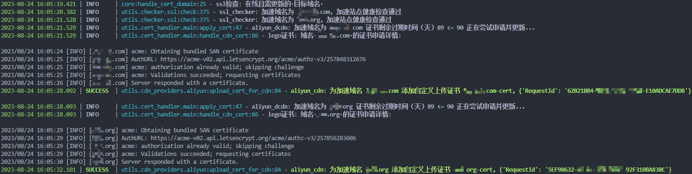
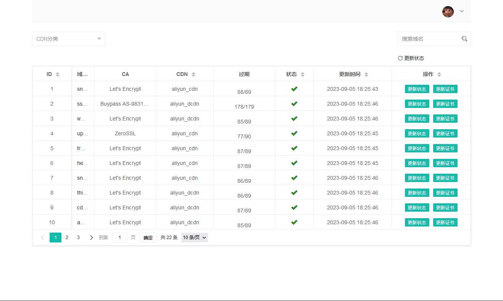

# cdn-auto-cert
CDN HTTPS 证书自动更新，支持阿里云、腾讯云、华为云

## 1. 说明
1. 读取CDN正在使用的加速域名，获取正在使用（正确配置cname）且开启HTTPS的加速域名
2. 检测加速站点证书过期时间，满足设定阈值触发重新申请证书或报警（邮件）
3. 调用lego申请证书、上传更新到对应cdn供应商

## 2. 功能
+ 支持CDN加速域名证书定时检测、证书申请、证书上传
+ 支持匹配多级域名、全域名
+ 支持UI查看域名证书状态、手动（自动）更新证书和状态
+ 支持指定证书申请机构
+ 支持证书过期邮件通知
+ 支持命令行、Docker运行

## 3. 配置
1. 公共配置文件：[config.py](./configs/config.py)
2. CDN-DNS配置文件：[providers.yml](./configs/providers.yml)
3. 供应商秘钥文件：[secret.py](./configs/secret.py)
> 提示：
**添加新的CDN加速域名首次需手动开启https并手动上传证书**

## 4. 运行
### 1. 手动
``` shell
pip3 install -r requirements.txt -i https://pypi.doubanio.com/simple
python3 auto_cert.py
```

### 2. 定时
```shell
pip3 install -r requirements.txt -i https://pypi.doubanio.com/simple
python3 auto_cert_scheduler.py
```
---
支持面板，默认账号密码：admin/admin
```shell
pip3 install -r requirements.txt -i https://pypi.doubanio.com/simple
python3 app.py
```
### 3. docker
```shell
docker build -t cdn-auto-cert:latest -f Dockerfiles/basic/Dockerfile .
docker run --name cdn-auto-cert -it \
  -v $PWD/configs/config.py:/home/config/config.py \
  -v $PWD/configs/providers.yml:/home/config/providers.yml \
  -v $PWD/configs/secret.py:/home/config/secret.py \
  -d cdn-auto-cert:latest
```
---
支持面板，默认账号密码：admin/admin
```shell
docker build -t cdn-auto-cert-ui:latest -f Dockerfiles/ui/Dockerfile .
docker run --name cdn-auto-cert -it \
  -p 8080:8080 \
  -v $PWD/configs/config.py:/home/config/config.py \
  -v $PWD/configs/providers.yml:/home/config/providers.yml \
  -v $PWD/configs/secret.py:/home/config/secret.py \
  -d cdn-auto-cert-ui:latest
```

## 5. 截图
<div align="center">
  
  <p>日志</p>
  
  <p>面板</p>
</div>

## 6. 环境
+ python3.9.6^
+ [lego](https://github.com/go-acme/lego)
+ [layui](https://github.com/layui/layui)
